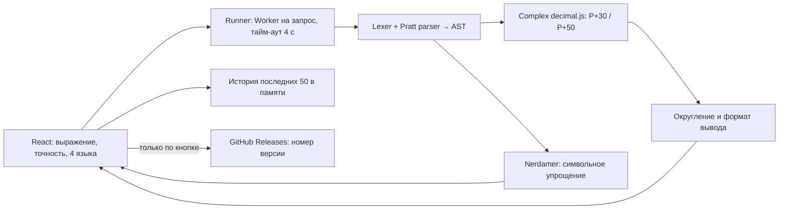

# Техническая документация

## Слои



## Файлы и ответственность

| Файл | Ответственность |
| --- | --- |
| `src/engine/parser.ts` | Лексический анализ, ограничения, AST, безопасная канонизация |
| `src/engine/numeric.ts` | Комплексные операции над Decimal, главные ветви, контроль диапазона |
| `src/engine/index.ts` | Проверка запроса, выбор режима, два прохода, ошибки CAS |
| `src/engine/format.ts` | Округление каждой компоненты, авто/научный формат |
| `src/engine/worker.ts` | JSON-совместимый протокол сообщений |
| `src/services/runner.ts` | Жизненный цикл Worker, отмена, тайм-аут, защита от позднего ответа |
| `src/services/updates.ts` | Семантическое сравнение версии, запрос без cookies и пользовательских выражений |
| `src/i18n.ts` | Полные типизированные словари RU/EN/ES/ZH |
| `src/components/*` | Панель точности, история, диалоги, иконки |
| `src/App.tsx` | Координация состояния формы, результатов и истории |
| `scripts/package.mjs` | Автономный артефакт, версия, контрольная сумма |

## Грамматика

```text
expression := prefix (binaryOperator expression)*
prefix     := number | name | ('+'|'-') expression | '(' expression ')'
            | function '(' expression ')'
number     := decimal (('e'|'E') ('+'|'-')? digits)?
name       := 'pi' | 'e' | 'i' | 'x' | 'y' | 'z'
```

Приоритеты Pratt: `+ -` → 10, `* /` и неявное умножение → 20, унарные `+ -` → 25, `^` → 30. Степень правоассоциативна. Список функций фиксирован; произвольных свойств/функций пользователя нет. Между двумя числовыми токенами неявного умножения нет. `serialize()` строит полностью скобочный ввод CAS из AST. Приложение не вызывает JavaScript `eval` и не передаёт непроверенный исходный ввод в CAS. Сторонняя библиотека сама имеет большую поверхность кода; Worker не считается полноценной изоляцией безопасности от злонамеренной библиотеки.

## Численная модель

Комплексное число — `{re: Decimal, im: Decimal}`. Каждый расчёт использует собственный `Decimal.clone`, поэтому глобальная точность не меняется. Литералы поступают из строк, не через JavaScript Number. Number применяется к ограниченным целым параметрам точности/показателя и не несёт длинное числовое значение.

Умножение: `(ac−bd)+(ad+bc)i`. Деление масштабируется отношением компонент вместо безусловного `c²+d²`. Модуль — `Decimal.hypot`.

Комплексный корень выбирает устойчивую формулу: сначала вычисляется большая компонента, меньшая получается из `2uv=b`. Это сохраняет малую мнимую часть у `sqrt(1+1e-80*i)`. Для отрицательного действительного аргумента возвращается положительная мнимая часть. Знак отрицательного нуля на разрезе канонизируется.

Целая степень: возведение двоичным разложением O(log n). Нецелая/комплексная: `exp(w*ln(z))`, отдельно обработаны ноль и квадратный корень. Логарифм: `ln|z| + i atan2(b,a)`, главная ветвь. Комплексные sin/cos используют стандартные гиперболические формулы.

Первая оценка использует P+30 значащих цифр, вторая P+50; результат первой округляется до P, вторая сравнивается после округления. Разница вызывает предупреждение. Это эвристика диагностики, не интервальная арифметика и не гарантия всех P верных цифр. Одинаковая катастрофическая потеря на обоих проходах может остаться незамеченной. Порог «маленькое значит ноль» не используется.

Округление half-even снижает систематический сдвиг при многократном округлении. Автоформат без дополнительных нулей; научный формат с ровно выбранным количеством значащих цифр. Для чисел с несколькими компонентами точность относится к каждой компоненте отдельно.

## Протокол вычислителя

```ts
type Request = { expression: string; precision: number; mode: 'numeric'|'symbolic' };
type Reply = { ok: true; result: {
  mode: 'numeric'|'symbolic';
  value?: { re: string; im: string };
  symbolic?: string;
  warnings: ('rounding'|'symbolicDomain')[];
}} | { ok: false; code: string };
```

Worker создаётся для каждого запроса и уничтожается при завершении, ошибке, отмене или тайм-ауте. Это освобождает состояние CAS и предотвращает рост его истории между расчётами. Одновременное выполнение двух задач из одной вкладки не требуется. UI хранит номер запроса: старый ответ не может заменить результат более нового ввода. Изменение выражения/режима/рабочей точности убирает устаревший результат. Изменение вывода лишь форматирует уже вычисленные компоненты.

Ошибки: `EMPTY`, `SYNTAX`, `UNKNOWN_NAME`, `LIMIT`, `DIV_ZERO`, `DOMAIN`, `NON_FINITE`, `PRECISION`, `TIMEOUT`, `WORKER`, `INTERNAL`; отмена runner — `CANCELLED`. Пользователь получает локализованное сообщение, а не стек вызовов.

## ADR-001: переносимый статический продукт

Решение: один HTML, библиотечная арифметика в Worker, без back-end/БД/логинов/PWA-install. Альтернативы: C++/Qt (нужны пакеты/подписи на каждую ОС), Electron (большой runtime и частые обновления), серверный Python/SymPy (хостинг, доступность, API и конфиденциальность).

Последствия: простой перенос/удаление и почти нулевые операционные расходы; ограничения браузерной среды и отсутствие автоматической фоновой синхронизации. Новые браузеры всё равно требуют квалификационных проверок. Не переносим без изменений нереалистичное обещание «любая платформа навсегда».

## ADR-002: численный и символьный режимы разделены

Большая комплексная точность не поддерживается обычной парой JavaScript Number. Численно используем decimal.js для обеих компонент; Nerdamer отвечает только за символьные преобразования. Результаты CAS не выдаются за численные значения с 200 гарантированно верными цифрами. Граница позволяет независимо тестировать и заменять библиотеки.

## Источники решений

- [decimal.js API](https://mikemcl.github.io/decimal.js/) — clone, precision, half-even, sqrt, гиперболические функции.
- [Nerdamer source/documentation](https://github.com/jiggzson/nerdamer) — установленная версия закреплена в package-lock, онлайн-документация может описывать более новую.
- [vite-plugin-singlefile](https://github.com/richardtallent/vite-plugin-singlefile) — объединение JS/CSS в HTML.
