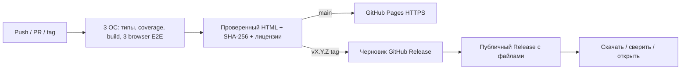

# Деплой, обновления и сопровождение

## Pipeline

Workflow `.github/workflows/ci.yml` использует официальные Actions, закреплённые по SHA. Обычным jobs доступны только чтение кода; запись Pages/Release выдаётся соответствующему job. Секреты не включаются в HTML. Build без внешних CDN, зависимости устанавливаются `npm ci`.

Проверки идут на Ubuntu/Windows/macOS. Проверенный артефакт Ubuntu передаётся в deployment/release job, не пересобирается после приёмки. Публикация ветки main — только после успешной матрицы. На PR выполняются проверки без публикации. При неуспехе предыдущая версия Pages остаётся доступной.

## Первоначальная настройка GitHub

Публичный репозиторий `kotyasmol/radical-lab`. В Settings → Pages источник — GitHub Actions. Необходимо разрешить Actions в репозитории и исходящее скачивание пакетов на runner. Если действуют организационные ограничения, администратор согласует их отдельно. Расширенные защиты ветки следует включать с учётом команды; здесь работающие workflows не подменяют policy запрета прямого push.

## Выпуск

1. Закрыть блокирующие дефекты; актуализировать требования/отчёт.
2. Синхронно изменить `package.json` (и lock), `VERSION` в `src/services/updates.ts`, CHANGELOG.
3. `npm run check`; проверить переносимый HTML.
4. Создать коммит, дождаться зелёной CI основной ветки.
5. `git tag v1.0.1`, затем `git push origin v1.0.1` (пример следующего релиза).
6. Tag-workflow повторяет приёмку и создаёт черновик release с HTML, суммами и лицензиями, затем публикует его. Версия тега проверяется против package.json.
7. Скачать asset из release, сверить SHA-256, выполнить smoke. Проверить, что «Обновления» видит новую версию.

Семантические версии: patch — исправления без изменения пользовательского контракта; minor — совместимые функции; major — несовместимая грамматика/результаты/минимальные платформы. Предрелизы `-beta` не выбираются механизмом stable-обновления. Не изменять содержимое уже выпущенного тега/asset: исправление — новый patch.

## Обновления пользователя

Фоновая самозамена отсутствует. По кнопке приложение запрашивает только GitHub `releases/latest`, проверяет формат `vMAJOR.MINOR.PATCH` и сравнивает числовые части. Никаких выражений, истории, cookies или ключей в запросе. Шестисекундный тайм-аут; недоступность сервиса не влияет на расчёты. Сообщение API не используется как HTML, а адрес ссылки всегда фиксированный.

Пользователь экспортирует нужную историю и открывает новый HTML. Замена не прерывает текущий расчёт и не навязывает перезагрузку. Миграция базы не нужна, поскольку базы нет. Веб-страница обновляется при следующей загрузке; service worker, способный удержать старую версию, не устанавливается.

## Откат и отказоустойчивость публикации

- Офлайн: открыть сохранённый предыдущий HTML.
- Онлайн: вернуть код на проверенный релиз отдельным revert-коммитом, запустить pipeline; не переписывать публичную историю без необходимости.
- Сбой Pages: предложить релизный HTML; уже скачанные копии работают независимо.
- Сбой Actions/реестра: не выпускать непроверенную сборку; прежний release не удалять.
- Утечка аккаунта GitHub: отозвать скомпрометированные полномочия, расследовать по стандартному процессу владельца; один checksum с того же взломанного сервера недостаточен для доверия.

## Мониторинг и сообщения о проблемах

Телеметрия пользовательских выражений намеренно отсутствует. Отслеживаются результаты Actions и сообщения GitHub Issues. Для бага нужны версия приложения, ОС/браузер, шаги, ожидаемый и фактический результат; приватные вычисления пользователь не обязан публиковать. Локальный timeout — контролируемый отказ, а не падение приложения.

Dependabot ежемесячно предлагает обновления npm и Actions. Автоматического merge нет: только review и полный набор тестов. Следить за уведомлениями об уязвимостях нужно отдельно — ежемесячный график не оправдывает задержку критического исправления.

Приоритеты (целевая политика, не договор SLA): P0 — утечка/опасный публичный релиз, первичная оценка в рабочий день обнаружения; P1 — неверный результат/невозможность запуска, ближайший patch; P2 — UI/перевод, следующий плановый выпуск. Ответственный и бюджет должны быть назначены реальной командой.

Долгосрочный график и условная стоимость: [PROJECT_PLAN](PROJECT_PLAN.md). Не обещать неизменность кода на десять лет: поддерживается контракт, а необходимые исправления разрешаются.
