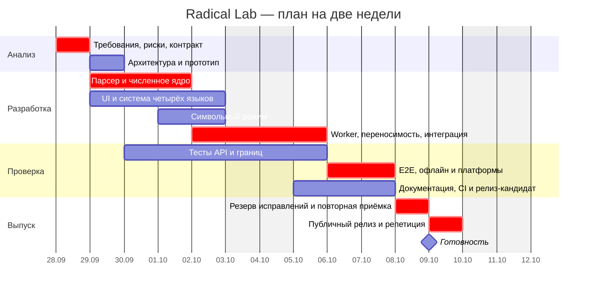

# Управление проектом: две недели

## Исходные условия

Учебный план рассчитан на **три человека**, десять рабочих дней в двух календарных неделях. Имена участников преподаватель/бригада вписывают вместо A/B/C. Это план и расчётная модель, а не утверждение о фактически отработанных часах. Пример календаря: старт 28 сентября 2026, готовность 9 октября; крайний срок при отсчёте двух недель от 26 сентября — 10 октября 2026. Если преподаватель считает иначе, календарь сдвигается без изменения зависимостей.

Объём замораживается после первого дня. Обязательное: комплексная длинная арифметика, выражения, точность, 4 языка, переносимость, тесты, документы и опубликованный выпуск. Графики, аккаунты, облачная история, импорт и нативные установщики не входят в v1.0.

## Персонал и квалификация

| Участник | Роль                        | Что должен уметь                                               | Ответственность                                               | План, ч |
| -------- | --------------------------- | -------------------------------------------------------------- | ------------------------------------------------------------- | ------: |
| A        | Техлид / разработчик ядра   | TypeScript, комплексные числа, численные ошибки, Git, review   | Требования, AST, арифметика, интеграция, релиз                |      72 |
| B        | Frontend / UX / локализация | React, CSS, формы, accessibility, i18n                         | Интерфейс, состояния, языки, адаптивность, встроенная справка |      64 |
| C        | QA / DevOps / документация  | Классы эквивалентности, Playwright/Vitest, CI, техписательство | Тест-план, автоматизация, CI/CD, документы и приёмка          |      64 |
|          |                             |                                                                | **Итого**                                                     | **200** |

Доступность по 8 ч × 10 дней × 3 = 240 ч. План 200 ч оставляет 40 ч временного резерва. Это интенсивный график; если у студентов доступно только 2–3 часа в день, нужно больше участников или согласованное сокращение требований. Работа за рамками доступности не скрывается в планировании.

Испанский и китайский: разработчик обеспечивает полноту ключей и функциональную проверку переключения. Перед внешним коммерческим использованием нужен review носителями; текущие переводы не называются профессионально сертифицированными.

## Распределение работ

| Пакет                                |      A |      B |      C | Выход / зависимость                |
| ------------------------------------ | -----: | -----: | -----: | ---------------------------------- |
| Требования и архитектура             |     12 |      4 |      4 | Контракт и критерии приёмки        |
| Парсер, числа, комплексные операции  |     28 |      0 |      6 | Ядро API → UI-интеграция           |
| Символьный режим и ограничения       |     10 |      0 |      4 | Проверенный CAS-адаптер            |
| GUI, четыре языка, доступность       |      4 |     36 |      6 | Сквозной пользовательский сценарий |
| Fault tolerance и переносимая сборка |      8 |      8 |      4 | Worker, тайм-аут, HTML             |
| Системные тесты и исправления        |      6 |      8 |     18 | Зелёная матрица тестов             |
| Документы, CI/CD, выпуск, защита     |      4 |      8 |     22 | Готовый артефакт и публичный релиз |
| **Всего**                            | **72** | **64** | **64** | **200 часов**                      |

Автор не принимает собственный пакет в одиночку: A ревьюит B, B проверяет пользовательские сценарии C, C проверяет ядро A. Техлид отвечает за согласованность интерфейсов, а не выполняет все задачи сам.

## Диаграмма Ганта

Критический путь: контракт → ядро → интеграция → системная проверка → исправления → выпуск. Локализация и документация идут параллельно, но становятся блокирующими на приёмке.

## Как соблюдать сроки

- Ежедневно 10–15 минут: сделано, следующий проверяемый результат, блокеры. Канбан: Backlog / Ready / In progress / Review / Done. WIP — одна основная задача на участника.
- Задача содержит критерий завершения и оценку ≤1 дня. Более крупную разбиваем. Код, тест и документ обновляются в одном PR.
- В конце дней 2/5/8 — демонстрация работающего приложения; прогресс оценивается по принятым требованиям, а не строкам кода.
- Отставание критического пути более одного дня требует перепланирования в тот же день: перераспределить резерв, убрать необязательный scope, согласовать последствия. Нельзя компенсировать это молчаливым отказом от четырёх языков или тестов.
- После дня 8 только дефекты и документы. Функции добавляются после защиты в следующую версию.
- Definition of Done: review, типы, unit/integration/E2E, документация, release artifact, принятый сценарий. Незавершённые проверки явно блокируют выпуск.

## Учебный бюджет и оплата труда

Ставки ниже **условные для учебного расчёта**, не исследование рынка и не оформленная трудовая договорённость. Для реальной сметы отдельно учитываются налоги, взносы, договоры и накладные расходы по применимым правилам.

| Роль                       | Часы | Условная ставка, ₽/ч |   Сумма, ₽ |
| -------------------------- | ---: | -------------------: | ---------: |
| A: техлид / ядро           |   72 |                 1200 |      86400 |
| B: frontend / UX           |   64 |                 1000 |      64000 |
| C: QA / DevOps / документы |   64 |                  900 |      57600 |
| Прямые трудозатраты        |  200 |                    — | **208000** |
| Денежный резерв 20%        |    — |                    — |  **41600** |
| Расчётный бюджет           |    — |                    — | **249600** |

Денежный резерв 20% и временной резерв 40 ч — разные величины; расход денег зависит от того, какие роли используют часы. Лицензии runtime-библиотек открытые. Бесплатность конкретного GitHub-плана/лимитов проверяется перед использованием, тариф не считается вечной гарантией. Платные ресурсы проект автоматически не покупает.

Учёт: задачи → фактические часы → недельная сверка с оценкой. Условная схема оплаты для согласования: 20% после принятия контракта, 40% после интеграционной демонстрации, 40% после приёмки. Это пример, не совершённый платёж и не обязательство пользователя.

## Roadmap продукта и поддержки

| Период после v1.0    | Работа                                                                                 | Оценка / критерий                                                         |
| -------------------- | -------------------------------------------------------------------------------------- | ------------------------------------------------------------------------- |
| Первые 2 недели      | Собирать баги, закрывать блокирующие, v1.0.x                                           | Приоритет корректности, без расширения scope                              |
| Каждый месяц         | Просмотр зависимостей/уязвимостей, triage issues                                       | Базово 4 ч/месяц; критические инциденты вне этой квоты                    |
| Каждый квартал       | Тесты на актуальных браузерах, проверка ссылок/восстановления релиза                   | Документированный отчёт совместимости                                     |
| Через 6 месяцев      | Проверка переводов носителями и UX                                                     | При наличии пользователей/ресурсов                                        |
| Раз в год            | Пересмотр поддержки ОС, зависимостей и архива сборки                                   | Проверить запуск старого артефакта и сборку из lock                       |
| Годы 2–10            | Поддержка компактного scope, исправления по необходимости                              | Годовой бюджет, назначенный владелец; нельзя обещать отсутствие изменений |
| Завершение поддержки | Объявить срок, сохранить исходники/HTML/лицензии/суммы, убрать обещание новых проверок | Пользователи сохраняют работоспособный офлайн-артефакт                    |

Пример базовой сметы сопровождения: 4 ч × 12 × 1000 ₽ = 48000 ₽/год; чрезвычайные исправления, обновления платформ и новые функции оцениваются отдельно. Обязательства на 10 лет требуют реального владельца и бюджета, они не возникают из этого документа.

## Риски

| Риск                                          | Вероятность / ущерб | Ответ                                                                            |
| --------------------------------------------- | ------------------- | -------------------------------------------------------------------------------- |
| Требование «обязательно C++» выяснится поздно | Средняя / высокий   | Уточнить на первой демонстрации; текущий выбор языка явно записан                |
| Неясно, что значит «точность»                 | Высокая / высокий   | Отделить цифры от гарантированной погрешности, показать пример потери значимости |
| Символьный CAS зависает                       | Средняя / высокий   | Allowlist AST, Worker, ограничения, тайм-аут                                     |
| Ошибки перевода                               | Средняя / средний   | Типизированные ключи, UI-тесты, review носителя перед внешним выпуском           |
| Несовместимость локального HTML               | Средняя / высокий   | `file://`-тесты по движкам, заявленная матрица и резерв                          |
| Недоступен GitHub                             | Низкая / средний    | Локальный артефакт продолжает работать, архив исходников                         |
| Участник недоступен                           | Средняя / высокий   | Review вторым человеком, маленькие задачи, документация                          |
